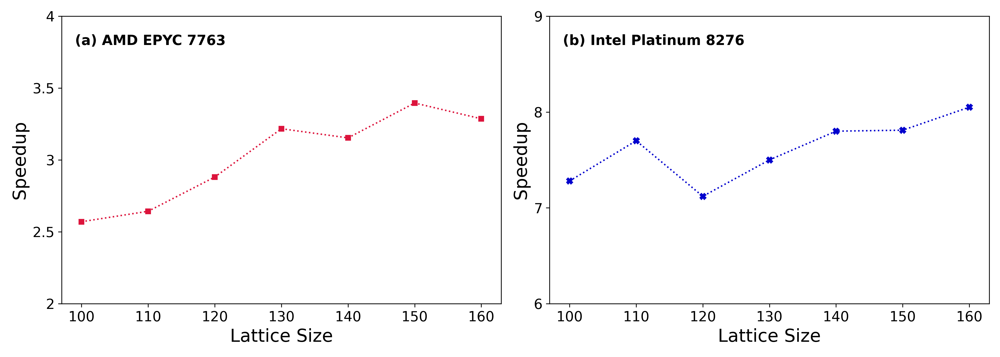

# A High-Performance Implementation of Atomistic Spin Dynamics Simulations on x86 CPUs

This repository contains the supporting code for this research work: https://arxiv.org/abs/2304.10966. In this work, we propose to use a highly optimized general matrix multiply (GEMM) subroutine to calculate the dynamical spin-spin correlation function in real space. Furthermore, we fuse the element-wise operations in the calculation of $S(\mathbf{q}, t)$ into the in-house GEMM kernel, which results in further performance improvements of 44\% - 71\% on several relatively large lattice sizes when compared to the implementation that uses the GEMM subroutine in OpenBLAS. 

## Speedup over baseline

## Performance improvement fo kernel fusion

